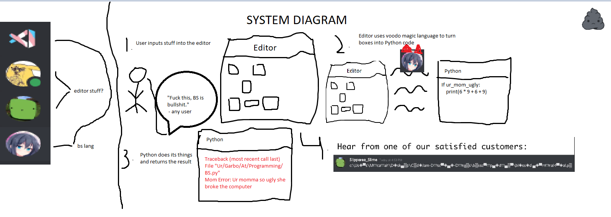

# BoxScript



BoxScript, or BS for short, is a language based on the idea of "boxes".

What are boxes, exactly? Boxes, and their younger sibling, blocks, are simply units of code. They can be loops, conditionals, or anything else, really. Expressions with different purposes go into different blocks, and blocks with different functions go into different boxes. Sounds simple, right?

BoxScript's most defining feature is encouraging **thinking inside the box** when writing code—literally, since no code can exist outside of a box. If that's not BS, then what is?

## Installation

1. Clone the repository

```sh
git clone https://github.com/somthecoder/CodeJam-Discrete-Dingos.git
```

2. Install dependencies

```sh
poetry install
```

## Requirements

* Python 3.9+
* A font which supports [Block Elements](https://www.unicode.org/charts/PDF/U1FB00.pdf), [Box Drawing](https://www.unicode.org/charts/PDF/U2500.pdf), and [Geometric Shapes](https://unicode.org/charts/PDF/U25A0.pdf)

## Contributors

* [エニラ#0013](https://github.com/pyxiis): Lead Programmer
* [A Real Username#8028](https://github.com/onerandomusername): CI Guru
